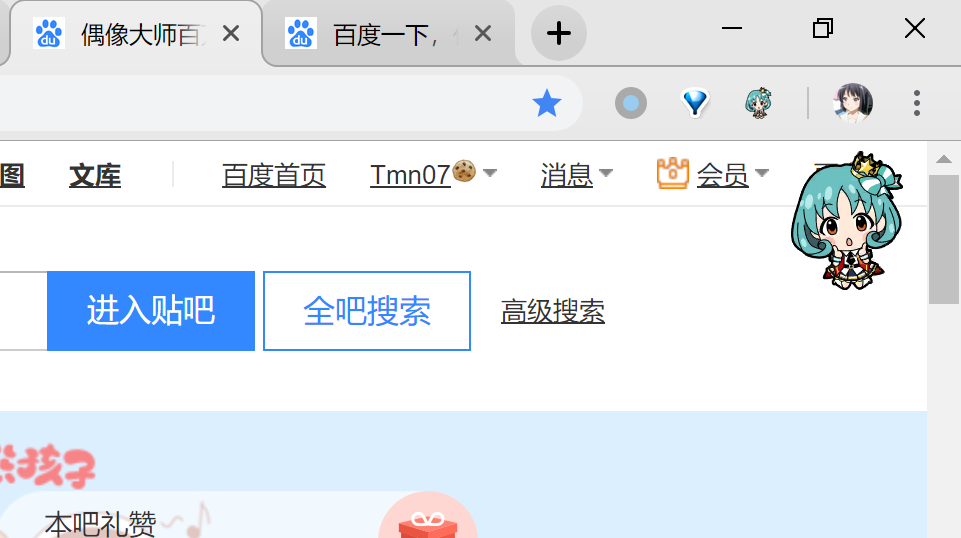

# show hime chrome extension

## intro

茉莉公主chrome插件，就是随机显示公主2D Q版形象在右上角

双击图片隐藏，按住图片移动位置，点击插件icon隐藏或展示，（右键页面任意处菜单中插件按钮点击播放ho

插件源码在src文件夹，直接拖入 chrome://extensions/ 即可，可能需要开启开发者模式。（之后也许会补充更具体的使用方式

（然后之后每一次启动chrome都会有烦人的提示，按Esc可以跳过）

## BUG

部分页面无法加载音源与图片（如github（昨天还可以啊？

## TODO

之后可能会做个土豆全员的，然后可以有页面支持自定义

- [ ] 七牛云的存储域名会变？

- [x] 挪动（不匹配触屏事件？

- [x] 音效 (还没找到合适的交互方式与高清ho源

- [x] 右键菜单 (已实现，但是目前没想好用于什么（目前用于播放低清ho

后台切换选择人物？多页面同步？

然后可能改写原生js（刚刚写的一堆bug，放弃了

## 小记

写挪动相关的事件时，遇到了一个坑，img标签的mouseup事件的因为图片本身的特性，有时候无法触发。使用div标签来代替。

我这里挪动的实现，就是mousedown添加一个mousemove的监听，然后mouseup移除这个监听 我是参考[这个](https://stackoverflow.com/questions/33948464/move-an-image-with-javascript-using-mouse-events)改的

PS：chrome ext真的好难调试啊（是我太蠢了（上一个坑还没填完，这里又开始放卫星了