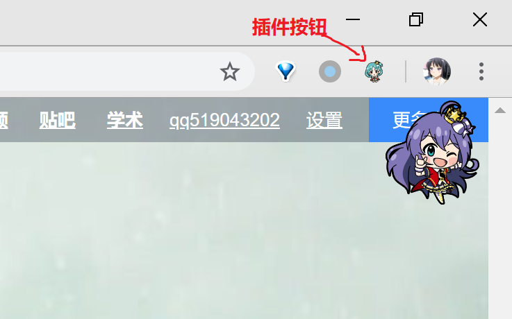
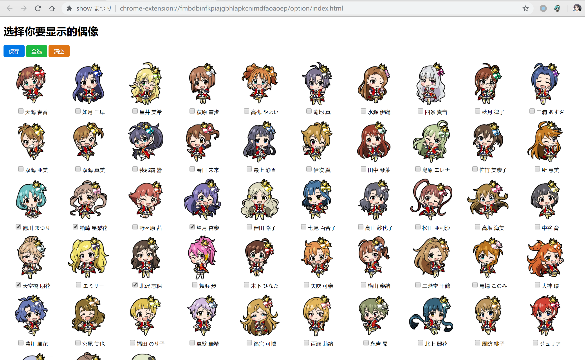

# show まつり插件

这是一个在网页上显示idol m@ster million stars 2d形象的一个chrome插件。

虽然名字叫show まつり，不过已经可以设置任意的idol了。

下载地址：https://chrome.google.com/webstore/detail/show-%E3%81%BE%E3%81%A4%E3%82%8A/fmbdbinfkpiajgbhlapkcnimdfaoaoep

代码地址：https://github.com/qq519043202/show-hime

## 使用说明

- 默认显示网页右上角，可以**进行拖动，双击隐藏，单击插件隐藏/显示**

  注：拖动后的位置会保存下来，新的网页会在最后拖到的位置显示idol

- 任意网页**右键菜单-插件按钮** 或 **右键插件-选项** 进入选项页面（如下图），选择想要显示的偶像-保存即可

  注：选择多个偶像后，每进入新页面会随机一个偶像显示（每个偶像可能会有多2d形象）；初始状态未设置idol情况下，默认显示まつり

## 意见与反馈

欢迎用任意联系方式戳我，qq, qq邮箱, github issue啥的

mail: tmn0796@gmail.com
